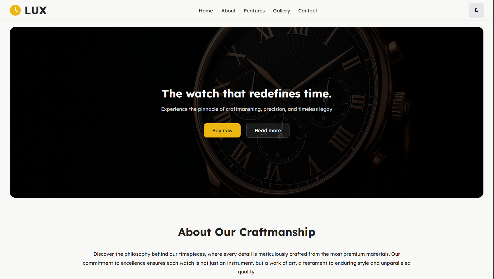

# AngWatch Website Template



Este é o meu **primeiro projeto Angular**.  
O objetivo foi criar uma **landing page moderna e responsiva**, utilizando **Angular** e **Sass** com uma estrutura organizada de componentes.

---

## Sobre o Projeto

O **AngWatch Website Template** é um projeto simples que serve como base para estudos e futuras melhorias.  
Ele demonstra como estruturar um projeto Angular com **componentes reutilizáveis**, **estilos modulares** em Sass e **boas práticas básicas de organização**.

O foco principal foi:

- Criar uma **landing page funcional**.
- Trabalhar com **Sass** de forma organizada.
- Compreender a **estrutura e fluxo de componentes Angular**.

---

## Tecnologias Utilizadas

- **Angular 19** — Framework principal para o front-end.
- **Sass (SCSS)** — Pré-processador CSS utilizado para estilização.
- **TypeScript** — Linguagem base do Angular.
- **HTML5 / CSS3** — Estrutura e base visual.

---

## Estrutura do Projeto

A organização geral segue o padrão do Angular CLI:

```
├── src
│   ├── app
│   │   ├── components
│   │   │   ├── about-section
│   │   │   │   ├── about-section.component.html
│   │   │   │   ├── about-section.component.scss
│   │   │   │   ├── about-section.component.spec.ts
│   │   │   │   └── about-section.component.ts
│   │   │   ├── cta-section
│   │   │   │   ├── cta-section.component.html
│   │   │   │   ├── cta-section.component.scss
│   │   │   │   ├── cta-section.component.spec.ts
│   │   │   │   └── cta-section.component.ts
│   │   │   ├── feature-section
│   │   │   │   ├── feature-section.component.html
│   │   │   │   ├── feature-section.component.scss
│   │   │   │   ├── feature-section.component.spec.ts
│   │   │   │   └── feature-section.component.ts
│   │   │   ├── footer
│   │   │   │   ├── footer.component.html
│   │   │   │   ├── footer.component.scss
│   │   │   │   ├── footer.component.spec.ts
│   │   │   │   └── footer.component.ts
│   │   │   ├── gallery-section
│   │   │   │   ├── gallery-section.component.html
│   │   │   │   ├── gallery-section.component.scss
│   │   │   │   ├── gallery-section.component.spec.ts
│   │   │   │   └── gallery-section.component.ts
│   │   │   ├── header
│   │   │   │   ├── header.component.html
│   │   │   │   ├── header.component.scss
│   │   │   │   ├── header.component.spec.ts
│   │   │   │   └── header.component.ts
│   │   │   ├── hero-section
│   │   │   │   ├── hero-section.component.html
│   │   │   │   ├── hero-section.component.scss
│   │   │   │   ├── hero-section.component.spec.ts
│   │   │   │   └── hero-section.component.ts
│   │   │   └── testimonial-section
│   │   │       ├── testimonial-section.component.html
│   │   │       ├── testimonial-section.component.scss
│   │   │       ├── testimonial-section.component.spec.ts
│   │   │       └── testimonial-section.component.ts
│   │   ├── app.component.html
│   │   ├── app.component.spec.ts
│   │   ├── app.component.ts
│   │   ├── app.config.ts
│   │   └── app.routes.ts
│   ├── scss
│   │   ├── _mixins.scss
│   │   ├── _variables.scss
│   │   └── main.scss
│   ├── index.html
│   ├── main.ts
│   └── styles.scss

```

A folha de estilos foi separada em **parciais Sass** para manter o código mais limpo e fácil de manter.

---

## Objetivos Pessoais

Este projeto foi criado para:

- Aprender na prática o funcionamento do Angular.
- Entender como dividir uma página em componentes.
- Praticar o uso de Sass com variáveis, mixins e imports.
- Desenvolver uma base sólida para futuros projetos front-end.

---

## ⚙️ Configuração do Projeto

Antes de iniciar o servidor, é necessário configurar o ambiente local.  
Siga os passos abaixo para preparar o projeto corretamente.

### 1. Clonar o Repositório

```bash
git clone https://github.com/manueljaime007/ang_watch_website_template.git
```

Entre no diretório do projeto:

```bash
cd ang_watch_website_template
```

2. Instalar Dependências

Certifique-se de ter o Node.js (versão 18 ou superior) e o Angular CLI instalados globalmente.

Verifique as versões instaladas:

```bash
node -v
npm -v
ng version
```

Se o Angular CLI não estiver instalado, instale com:

```bash
npm install -g @angular/cli
```

Agora, instale as dependências do projeto:

```bash
npm install
```

3. Rodar o Projeto Localmente

Após instalar as dependências, inicie o servidor de desenvolvimento com:

```bash
ng serve
```

Quando o servidor estiver ativo, abra o navegador e acesse:

http://localhost:4200/

A aplicação será recarregada automaticamente sempre que houver alterações no código.

4. Compilar para Produção

Para gerar a versão otimizada para deploy, use:

```bash
ng build
```

Os arquivos finais ficarão no diretório dist/.

5. Estrutura de Estilos Sass

Os arquivos Sass estão organizados em módulos separados dentro de src/styles/:

```
 scss
 │   ├── _mixins.scss
 │   ├── _variables.scss
 │   └── main.scss

```

Para adicionar novos estilos, importe-os dentro de main.scss.
